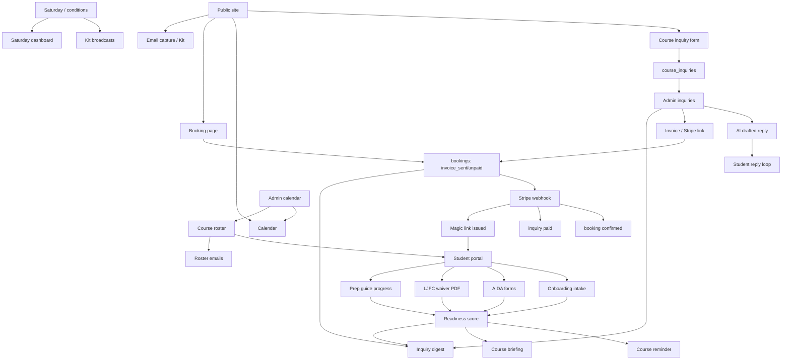
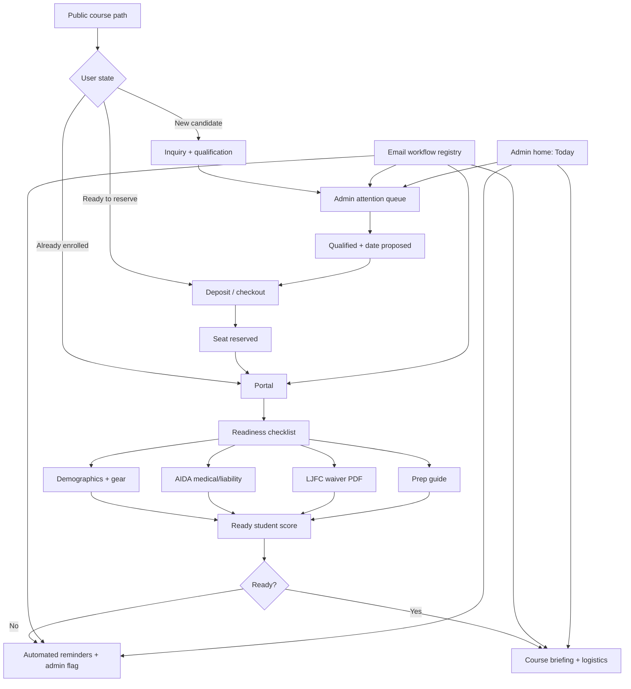

# LJFC Current-State Audit: Admin, Email, Forms, Onboarding

## Safety Constraint

The site is working. Do not break the operational system by doing a broad rewrite. Improvements should be additive, visible, and reversible. First priority is mapping and unification, not changing behavior.

## High-Level Assessment

LJFC has the pieces of a sophisticated small-operator enrollment system:

- public marketing pages;
- course inquiry capture;
- course calendar;
- Stripe checkout and invoice/payment links;
- inquiry admin pipeline;
- AI-drafted replies;
- AIDA forms;
- LJFC waiver PDF generation and email delivery;
- Camp Garibaldi registration/waiver flows;
- magic-link student portal;
- onboarding and demographic/gear intake;
- prep guide progress tracking;
- readiness scoring;
- course reminder emails;
- instructor briefing emails;
- conditions and Saturday email systems;
- internal education/curriculum spaces;
- partner/outreach/economics dashboards.

The main issue is not capability. The issue is **operational dispersion**: many needed admin areas exist, but there is no single operating model showing how they fit together, what sends email when, and which surface owns each stage of the student journey.

## Current Admin Surface Inventory

Admin hub currently links to:

- `/admin/inquiries` — course inquiry command center.
- `/admin/invoices` — create invoices/payment links.
- `/saturday` — Saturday RSVP/go-no-go dashboard.
- `/admin/calendar` — course/event manager.
- `/admin/courses` — course roster, enrollments, roster email actions.
- `/admin/registrations` — Camp Garibaldi registrations.
- `/admin/partners` — partner relationship tracker.
- `/admin/economics` — revenue calculator.
- `/admin/curriculum` — curriculum/session planning.
- `/admin/onboarding` — incoming student gear/demographic/theory preferences.
- `/admin/send-links` — send onboarding magic links.
- `/admin/students` — student progress/certification tracking.
- `/admin/send-forms` — email AIDA forms.
- `/admin/sitemap` — page/API map.

Observation: these are mostly legitimate tools. The problem is that they are presented as a flat grid rather than as an operating workflow.

## Current Email/Automation Inventory

### Public capture / list growth

- `EmailCapture.tsx` → Kit form subscription.
- `WeekendEmailForm.tsx` → Kit form subscription.
- `SaturdayRSVP.tsx` → Kit form subscription plus Saturday RSVP API.
- `ConditionsEmailForm.tsx` / conditions widgets → Kit subscription.

### Course inquiry and conversion

- `/api/course-inquiry`
  - student confirmation: “Course inquiry received”;
  - owner notification: “Course inquiry: {name} — {course}”.
- `/api/admin/inquiries/reply`
  - AI-drafted reply;
  - sends reply via Resend;
  - marks inquiry as replied.
- `/api/invoice`
  - creates Stripe checkout link;
  - creates booking/invoice row;
  - optionally emails invoice/payment link.
- `/api/checkout`
  - creates Stripe checkout from booking page;
  - creates pending booking row.
- `/api/webhook/stripe`
  - marks booking confirmed;
  - marks inquiry paid;
  - issues magic link;
  - emails student payment confirmation;
  - emails owner payment notification.

### Forms / waivers

- `/api/send-forms`
  - sends AIDA medical/liability form links.
- `/api/aida-forms`
  - emails student AIDA form confirmation;
  - emails owner AIDA form submission, including physician-required flag.
- `/api/waiver`
  - generates signed LJFC waiver PDF;
  - emails owner;
  - emails signer;
  - stores/logs waiver status.
- `/api/camp-waiver`
  - generates camp waiver PDF;
  - emails owner;
  - emails parent.

### Post-payment onboarding / readiness

- `/api/admin/send-links`
  - creates/updates student;
  - issues magic link;
  - emails onboarding link.
- `/api/auth/magic-link`
  - emails portal login link.
- `/api/admin/courses`
  - enroll action sends enrollment/onboarding email;
  - resend invite action sends prep/onboarding email;
  - blast action emails course roster.
- `/api/course-reminder`
  - sends course reminder with readiness-sensitive subject/body.
- `/api/course-briefing`
  - sends Joshua a pre-course briefing.
- `/api/inquiry-digest`
  - sends daily pipeline digest: stale inquiries, stalled deposits, groupings, upcoming readiness.

### Saturday / conditions

- `/api/friday-reminder`
  - reminds Joshua to send Saturday go/no-go.
- `/api/saturday-blast`
  - sends Kit broadcast.
- `/api/saturday-confirm`
  - owner notification for Saturday confirmation.
- `/api/saturday-rsvp`
  - student Saturday confirmation;
  - owner Saturday RSVP notification.
- `/api/daily-email`
  - generates conditions email;
  - test send via Resend;
  - broadcast via Kit.

## Current Student Data / Elicitation Inventory

The system collects or uses:

- name and email;
- phone;
- course interest;
- experience;
- preferred dates;
- group size;
- admin notes;
- parsed date window;
- booking/payment status;
- magic-link session state;
- demographic/sizing data: sex, height, weight, shoe size, shirt size;
- emergency contact;
- swim ability;
- freediving experience;
- breath-hold bucket;
- deepest dive bucket;
- fears/goals;
- theory preference;
- gear ownership/status;
- AIDA medical answers;
- physician-clearance need/status;
- AIDA liability release status;
- LJFC waiver status;
- prep guide progress;
- certification/progress records.

This is strong. The opportunity is to make this feel like **one student readiness model**, not many scattered intake points.

## Current State Map

## Holes / Opportunities

### 1. No single email workflow registry

There are many email send points, but no human-readable table answering:

- what sends;
- to whom;
- trigger;
- timing;
- source file/API route;
- template owner;
- whether it is manual, cron, webhook, or user action;
- whether it affects funnel status.

This is the biggest operational clarity gap.

Low-risk improvement: create `/admin/emails` or a static `docs/ops/email-workflows.md` first. Later, expose it in the admin dashboard.

### 2. Admin hub is flat instead of workflow-shaped

The current admin page lists everything equally. But your day-to-day operator mental model is not “which page exists?” It is:

- Who needs reply?
- Who needs qualification?
- Who has payment link but no deposit?
- Who paid but is not ready?
- What courses are coming up?
- What needs my human attention today?

Low-risk improvement: add a top-level “Today / Attention” dashboard or reorganize admin navigation into workflow groups.

Suggested groups:

- **Today** — attention queue, upcoming courses, stale leads, students not ready.
- **Enrollments** — inquiries, invoices, course roster, calendar.
- **Readiness** — onboarding, students/progress, forms, waivers, send links.
- **Programs** — camp registrations, curriculum, education.
- **Community** — Saturday, conditions email, partners.
- **Business** — economics, sitemap/system map.

### 3. Payment and inquiry status are related but not fully unified

Payment can be initiated from booking page, invoice page, admin courses, or inquiry pipeline. Stripe webhook links the latest active inquiry by email. That works, but it is a fragile seam when one person has multiple inquiries/bookings.

Low-risk improvement: make every payment link carry explicit `inquiryId` and `eventId` where possible, not only email/course metadata.

### 4. Readiness exists, but the admin view is fragmented

Student readiness is implemented in code and visible in portal pieces. But Joshua needs a single course-day readiness view:

- paid/deposit status;
- onboarding complete;
- AIDA medical complete;
- physician clearance needed/received;
- AIDA liability release;
- LJFC waiver;
- prep guide progress;
- gear plan;
- missing items.

Some of this exists in `/admin/courses`, `/admin/onboarding`, `/admin/students`, and `/portal`. Opportunity: one `Course Readiness` card per course.

### 5. Onboarding has good data capture, but unclear sequence ownership

There are multiple ways to send forms/onboarding links. That is useful operationally, but can create uncertainty:

- Did this student already get the right sequence?
- Which email did they receive?
- What should be sent next?
- Did we send forms before payment or after payment?

Low-risk improvement: add an “email/event timeline” to inquiry/student admin views later. First, map events in docs.

### 6. Public user path can fork too early

Public site offers courses, contact, booking, calendar, forms, waiver, portal, conditions, Saturday, etc. This is rich, but course candidates may not know whether to:

- inquire;
- book;
- sign forms;
- ask about dates;
- go to the portal;
- join Saturday sessions.

Low-risk improvement: make course CTAs consistently route by user state:

- “New here? Ask about a course.”
- “Ready to reserve? Pay deposit.”
- “Already enrolled? Open portal.”

### 7. Agent idea is valid, but should be second-order

A site agent could walk students through onboarding and answer “what do I need next?” But it should not become the source of truth. It should read from the same readiness model and knowledge base.

Low-risk sequence:

1. Map and clean readiness model.
2. Create student support knowledge base.
3. Add agent as a guided helper.
4. Escalate medical/safety/payment exceptions to Joshua.

## Alternative Streamlined Map

## Recommended Low-Risk Roadmap

### Step 1 — Current state visual map

Create and keep a visual source of truth for:

- admin surfaces;
- email workflows;
- student journey;
- payment/status transitions;
- readiness requirements.

No runtime changes.

### Step 2 — Email workflow registry

Create `docs/ops/email-workflows.md`, then optionally `/admin/emails`.

This answers “what is going out to people when?”

### Step 3 — Admin dashboard redesign plan

Do not rewrite pages yet. Design the target admin IA:

- Today / Attention;
- Enrollments;
- Readiness;
- Programs;
- Community;
- Business.

### Step 4 — Course readiness cockpit

Add or improve one view that shows each upcoming course and all student readiness blockers.

### Step 5 — Public CTA cleanup

Make course pages, calendar, contact, booking, and portal CTAs consistent by user state.

### Step 6 — Knowledge base / agent

Only after the system map is clear, introduce a bounded student helper agent.

## Strongest Recommendation

Start with the **Email Workflow Registry + Admin Information Architecture**.

Why: it gives immediate clarity without touching working flows. It also creates the foundation for any later automation or agent work, because an agent cannot safely guide students through a workflow that is not explicitly mapped.
